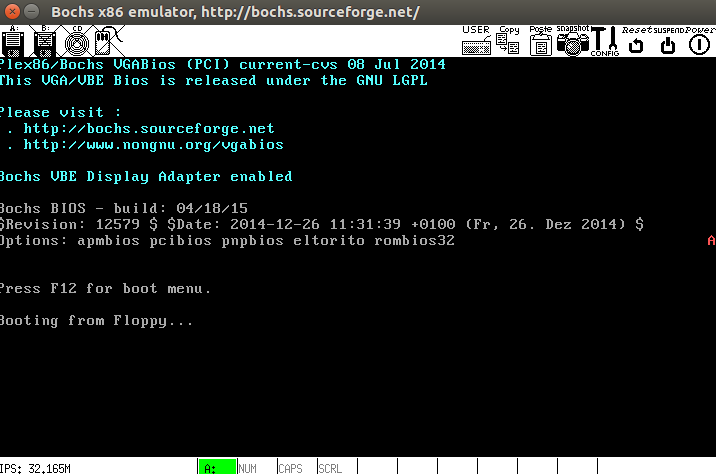
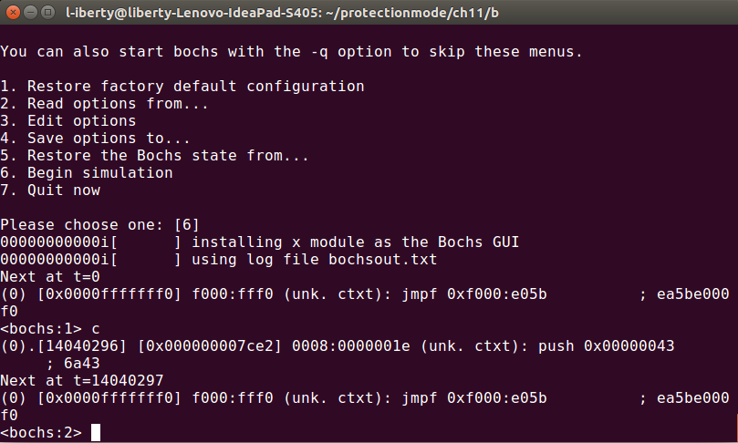
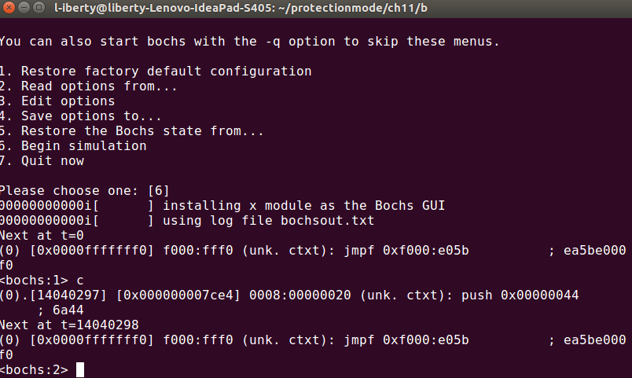

# 测试保护模式下的堆栈操作

## 反思
- 堆栈段应该是**向下扩展**的，但是《自己动手写操作系统》定义的堆栈段是**向上扩展**
- 《自己动手写操作系统》定义堆栈段时使用了变量`TopOfStack`，然而该变量指示的是栈底，应该叫`BottomOfStack`

## 实验
### 判断以下说法: *在32位代码中: 对于向下扩展的堆栈，`push`使`esp`减4; 对于向上扩展的堆栈，`push`使`esp`加4.*
`pmtest1.asm`运行结果:

`pmtest2.asm`运行结果:

**结论**: 栈的生长方向始终朝向低地址，与*向上/下扩展*无关. 段的扩展方向用于处理器的边界检查，而对堆栈的性质以及堆栈操作没有影响. *向下扩展*意味着，栈操作时必须满足`esp > 段界限 * 粒度值`; *向上扩展*意味着，栈操作时必须满足`esp < 段界限 * 粒度值`，但`esp < 0`不允许，实质是因为`ff***`这样的地址属于内核空间，或者计算机没有安装那么多内存.

### 在划分的12字节堆栈段内，两种扩展属性下，`push`指令最多执行多少次？为什么？
#### pmtest3
`pmtest3.asm`使用向下扩展的堆栈，段界限=0，`esp`初始值为12，即*栈底*相对*堆栈段线性基地址*的偏移字节量. 执行`push byte 'C'`时，先将`esp`减4后其值为0，`esp > 段界限 * 粒度值`不满足，操作被处理器阻止:

此外可以修改段界限为4或8，进一步验证实验结果.

#### pmtest4
`pmtest4.asm`使用向上扩展的堆栈，段界限=12-1=11, `esp`初始值为12, 首次`push`时，先将`esp`减4后其值为8, 8<11 * 1，允许执行；第4次`push`时因`esp=-4<0`被阻止:

