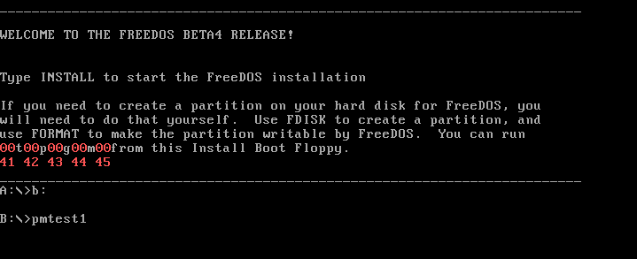
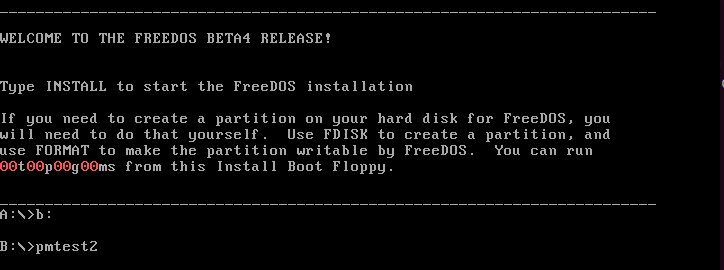
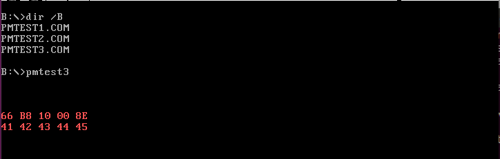
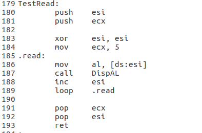

# 实验
**本实验在FreeDos下完成**

## pmtest1, 大地址内存读写
16位实模式最大寻址能力为 1MB，切换到32位保护模式后可以达到 4GB 寻址能力. `pmtest1.asm`定义了线性基地址为`0x500000(5MB)`、界限为`0xFFFF`、粒度为`字节`、向上扩展的数据段，用于测试大地址内存读写. 该数据段的有效读写范围是`0x500000 ~ 0x50FFFF`，长度为 64KB. 其中，`DispAL`参考了《一个操作系统的实现》，`TestRead`和`TestWrite`系自己编写. 运行成功，结果如下：

## pmtest2, 数据段访问保护
将`pmtest1.asm`中的数据段的界限改为3，其他不变. 由于数据段只有4字节，`TestRead`尝试读取第5字节(偏移为4,　超过界限值3)时引发异常:

## pmtest3 & pmtest4, 通过别名段读写代码段 & 直接读写代码段
### pmtest3
32位代码段定义为*只执行, 不可读写*，若将数据段描述符的线性基地址定义为代码段的线性基地址，则数据段是代码段的别名段，通过它可以读写代码段. 如图为`pmtest3.asm`的运行结果:

### pmtest4
修改`TestRead`，直接读写代码段，处理器将阻止不合法操作:

`mov	al, [cs:esi]`指令引发异常.
