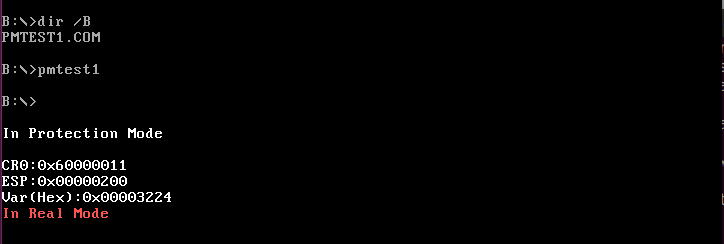

# `pmtest1.asm`在ch12基础上的一些改进

## 添加了保护模式下使用的一些实用例程
- `DispAL` (ch12中已实现)
- `DispAlChar`
- `DispStr`
- `Disp_DWORD` -> 主要用于显示寄存器内容，帮助调试

## 实现了从 32-bit 保护模式跳回 16-bit 实模式，并在实模式下显示字符串（向显存写入）

## 反思
- 保护模式下读写数据段、代码段内的转移指令等，是引发越界异常的主要因素.
