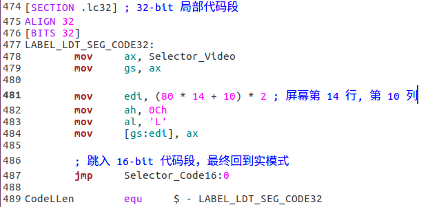
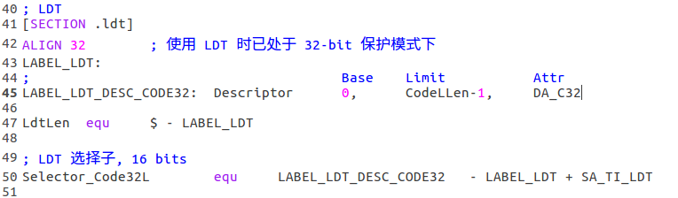
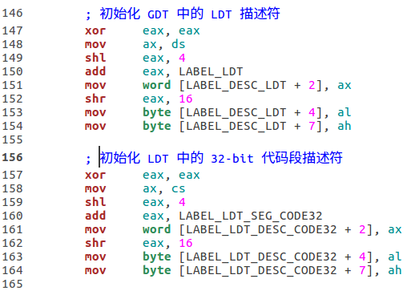
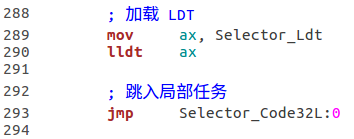
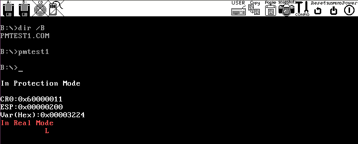
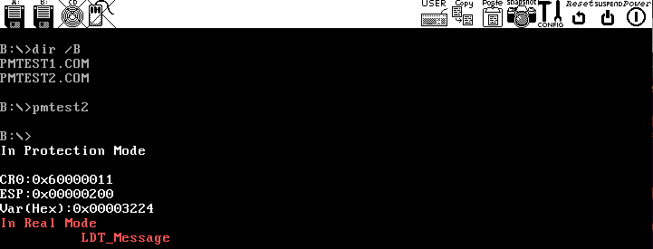

# `pmtest1.asm`测试 LDT

任务：由 GDT 中描述的全局代码段跳入 LDT 中描述的局部代码段，执行局部任务－－显示字符'L'，并回到实模式.

## 安装和使用 LDT 的步骤
**1. 定义局部(代码)段**

**2. 定义 LDT 中的描述符及其选择子**

**3. 在 GDT 中添加 LDT 的描述符及其选择子**

**4. 在实模式下的 16-bit 代码段中完成初始化工作**

**5. 进入保护模式后加载 LDT 后跳入局部任务 (加载 LDT 时已经处在保护模式下，因此对 LDT 的寻址需使用段选择子)**

## 运行结果

# `pmtest2.asm`在 LDT 中添加一个数据段描述符，并显示定义在新增数据段内的字符串

## 运行结果

