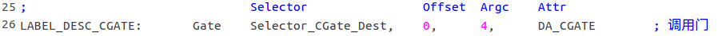
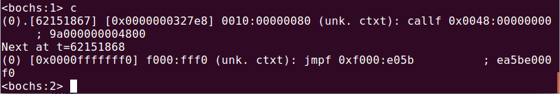

# `pmtest1.asm`调用门的安装与测试(无特权级转移, 参数个数=0)

## 1. 定义调用门目标代码段


## 2. 在 GDT 中定义目标代码段的描述符及其选择子


## 3. 在 GDT 中定义调用门及其选择子


## 4. 初始化调用门的目标代码段描述符


## 5. 测试调用门


## 6. 运行结果


# `pmtest2.asm`测试调用门的参数传递(无特权级转移，参数个数=4)
**注:** 本例中不存在栈切换，所以调用门属性中的*参数个数*字段对代码的执行无影响

一下为`pmtest2.asm`的关键代码:

## 修改调用门:



## 调用者传递参数:


## 调用门目标代码段:


## 运行结果:


# 测试调用门特权级检查

```
调用门特权级检查规则:
CPL <= 调用门描述符的 DPL
RPL <= 调用门描述符的 DPL

CPL >= 目标代码段描述符的 DPL
```
在之前的测试中所有成员的特权级都是0，因此调用门特权级检查得意通过
## `pmtest3.asm`降低调用门目标代码段的特权级

在`pmtest2.asm`基础上修改:


修改后, `CPL >= 目标代码段描述符的 DPL` 不满足，引发异常:



从控制台输出可见，`callf 0x0048:00000000`引发异常，而`0x0048`正是调用门选择子`Selector_CGate`.

# 在继续特权级变换实验前，把 LDT 和调用门的使用结合一下，得到`pmtest4.asm`
`pmtest4.asm`的任务: 加载 LDT,　跳入局部任务；局部任务中，先显示字符串"LDT_Message"，再通过调用门转移到相应的目标代码段，显示字符串"Gate"后返回局部任务(全过程无特特权级转移)，最后回到DOS实模式.

**运行结果:**


# `pmtest5.asm`完成特权级转移 ring0 -> ring3
> 原理见《x86汇编语言－从实模式到保护模式》p278, 14.5

## 1. 定义 32-bit ring3 堆栈段，并在 GDT 中添加其描述符，定义选择子，初始化该描述符
- 行号：`79~84`, `24`, `44`, `210~217`

## 2. 将视屏段描述符的 DPL 改为 `DPL_3`
- 行号: `19`

## 3. 定义 32-bit ring3  代码段，并在 GDT 中添加其描述符，定义选择子，初始化该描述符
- 行号: `632~646`, `25`, `45`, `220~227`

## 4. 如图，转移:


## 运行结果:


# `pmtest6.asm`完成特权级转移 ring3 -> ring0
> `pmtest5.asm`实现了 ring0 -> ring3 的转移后便停在了 ring3，`pmtest6.asm`在`pmtest5.asm`基础上修改，使其再从 ring3 转移到 ring0. 

## 1. 修改调用门描述符的 DPL 和调用门选择子的 RPL
使用调用门时必须满足调用门特权级检查规则:

```
CPL <= 调用门描述符的 DPL
RPL <= 调用门描述符的 DPL

CPL >= 目标代码段描述符的 DPL
```

所以，若想在 ring3 通过调用门转移到 ring0，需要修改调用门描述符的 DPL 和调用门选择子的 RPL　为`DPL_3`和`SA_RPL_3` (第29、44行)；目标代码段在 ring0，无需修改.

## 2. 准备 TSS (Task State Segment)
### 1) 定义 TSS 段


### 2) 在 GDT 中添加 TSS 描述符(DPL=DPL_0)，定义选择子(RPL=SA_DPL_0)，初始化该描述符

### 3) 在 32-bit ring0 代码段中加载 TSS 到*任务寄存器 TR*, 该操作在跳入 ring3 前完成


### 4) 在 ring3 中使用调用门完成特权级转移


### 5) 运行结果分析


**右边**
在 ring3 中首先将调用门的４个参数压栈，并调用`PrintStack_Ring3`打印栈信息，其中`00000025`是`PrintStack_Ring3`的返回地址(EIP)，其余４个dword便是刚才压栈的参数. 注意这里使用的是 ring3 栈段，可以通过`Disp_DWORD_Ring3`打印当前`ss`验证.

**左边**
通过调用门转移到目标代码段 ring0, 此时已经切换到新栈段，新栈的`SS`和`ESP`定义在 TSS 中. 现在来看新栈的内容，结合代码可知，`00000015`是`PrintStack_CGate`的返回地址(EIP); `0053`与`Selector_Code3`－－ ring3 代码段选择子－－等值，那么`0000002C`就是 ring3 代码段中`call  Selector_CGate:0`的下一条指令地址(EIP)了; 下面的4个dword便是从旧栈拷贝过来的参数; `000001F0`是`call  Selector_CGate:0`执行时刻的旧栈的ESP(ring3 栈段的ESP初始值为`0x200`, 4次`push`后其值为`0x1F0`)，`004B`是旧栈的`SS`，其值正好等于`Selector_Stack3`.

**注意: 对于有参数的调用门，返回时`retf`要带参数，并且调用者不必使用`add esp, n`清栈.**

# `pmtest7.asm`由调用门回到实模式
在`pmtest6.asm`基础上修改：在调用门末尾跳入局部任务，并修改 32-bit 局部代码段，就可以回到实模式. (局部代码段和调用门目标代码段位于 ring0, 可以直接`jmp`)

