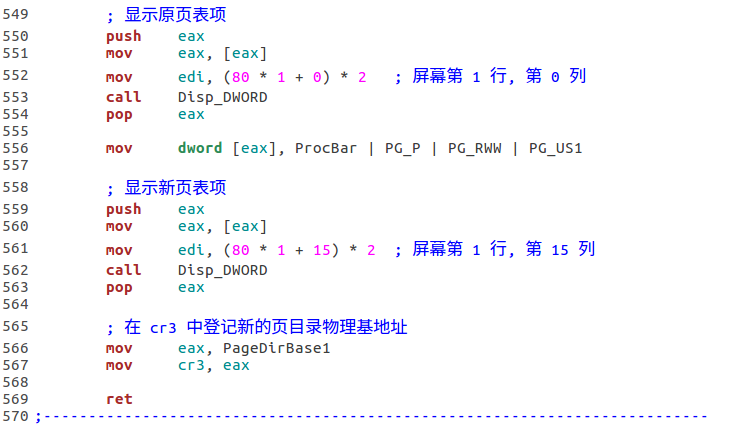

# `pmtest1.asm`启动分页机制
## 1. 定义页目录和页表的物理基地址


## 2. 在GDT中安装描述符，定义选择子


## 3. 启动分页机制


## 4. 添加测试代码


## 5. 运行结果


## 6. 说明
本例中的分页机制下，**物理地址=f(线性地址)=线性地址**. 使得该关系成立的条件是：所有页表连续存放，页表中的*页的物理基地址*从0开始且连续（任意相邻的页表项中存放的物理基地址相差4K）
```
例: 计算线性地址*0x80DD0008*对应的物理地址(假设物理内存足够大).
解:
    页目录中索引为 0 的页目录项对应的页表里存放的*页的物理基地址*为 0x0, 0x1000, ... 0x3FF00;
    页目录中索引为 1 的页目录项对应的页表里存放的*页的物理基地址*为 0x40000, 0x401000, ... 0x7FF00;
    页目录中索引为 2 的页目录项对应的页表里存放的*页的物理基地址*为 0x80000, ...
    
    *0x80DD0008* 高 10 位、中间 10 位和低 12 位的数值分别为 0x203, 0x1D0, 0x8.
    则:
    页目录中索引为 0x203 的页目录项对应的页表里存放的*页的物理基地址*为 (0x203 * 0x40000), (0x203 * 0x40000 + 0x1000), ...
    则该页表中索引为 0x1D0 的页表项的值为 (0x203 * 0x40000 + 0x1D0 * 0x1000), 加上页内偏移 0x8, 得到物理地址：
    0x203 * 0x40000 + 0x1D0 * 0x1000 + 0x8 = 0x80DD0008
```

# `pmtest2.asm`切换页表和页目录, 改变"线性地址~物理地址"的映射关系
**实现目标:**
开始，我们让`ProcPagingDemo`中的代码实现向`LinearAddrDemo`这个线性地址的转移，而`LinearAddrDemo`映射到物理地址空间中的`ProcFoo`处. `ProcFoo`打印红色的字符串`Foo`，所以执行时应该可以看到红色的`Foo`. 随后改变地址映射关系，令`LinearAddrDemo`映射到物理地址空间中的`ProcBar`处，那么再次调用`ProcPagingDemo`时，程序将转移到`ProcBar`处执行，我们将看到红色的`Bar`.
以下将`ProcPagingDemo`, `LinearAddrDemo`, `ProcFoo`和`ProcBar`简称`F4`.

## 1. 定义两套页目录和页表
**常量:**


**描述符:**


**选择子:**


## 2. 修改`SetupPaging`, 使用 0 号页目录和页表

## 3. 定义`F4`物理地址常量


## 4. 在 32-bit 代码段中定义三个过程


## 5. `PageSwitch`完成切换




> 注意到本例中，页表是连续存放的，否则`PageSwitch`是无法使用那样的代码定位到页表项并完成修改的

## 6. 定义两个段，用以直接通过之前定义的物理地址常量访问内存
> 注意到本例中, 线性地址=物理地址


## 7. 演示的过程
* 将三个过程的代码从 32-bit 代码段拷贝到之前定义的物理地址处
* 调用`SetupPaging`启动分页
* 调用`ProcPagingDemo`
* 调用`PageSwitch`切换地址映射关系
* 再次调用`ProcPagingDemo`

**将上述步骤封装为`PagingDemo:`**


> 由于需要读取 32-bit 代码段，需要修改对应的描述符属性

## 8. 运行结果


# `pmtest3.asm & pmtest4.asm`
`pmtest2.asm`大部分设计参考了《一个操作系统的实现》，书中没有解释我的疑惑：*既然是改变地址映射关系，直接修改页表项不就行了，为什么要定义两套页目录和页表呢?* 事实上，若想修改页表项，则需要对页表项寻址，由于寻址时分页机制已经启动，因此使用的地址不再是物理地址，然而与页目录和页表有关的地址参数均为物理地址，所以无法使用代码完成页表项的寻址，除非线性地址等于物理地址——这在本例的地址映射关系下是成立的，所以`pmtest3.asm`的实验从原理上讲是完全错误的.

## `pmtest3.asm` 只使用一套页目录和页表
`TLB, Translation Lookaside Buffer`, 可以理解为页表缓冲，CPU寻址时优先使用TLB而不是内存中的页表. 对`TLB`的刷新通过写 CR3 来实现，所以在原先的页表上做修改后只需重写 CR3 即可使修改后的页表生效. 据此，修改`PageSwitch`如下:


**运行结果:**


发现原页表项的`A(Accessd)`位为 1, 说明此表项所指向的页被访问过，这是符合事实的，刚才确实执行了其中的代码.

## `pmtest4.asm` 把重写CR3的代码去掉，则由于 TLB 没有刷新，地址映射关系不变
