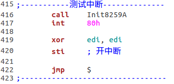

# `pmtest1.asm`测试中断(无特权级级转移，使用中断门)

## 1. `Init8259A`例程初始化 8259A 芯片

## 2. 定义中断描述符表 IDT 及相关信息

**Tips:** IDT不需要选择子. 中断或异常发生时，处理器用中断向量乘以 8 的结果区访问 IDT, 从中取得对应的描述符.

## 3. 在 16-bit 实模式代码段中加载 IDTR

**Tips:** 加载 IDTR 前必须关中断.

## 4. 定义中断处理过程
> 本例的中断处理过程位于 32-bit 代码段内部

## 5. 运行结果

# `pmtest2.asm`测试时钟中断(无特权级转移，使用中断门)
时钟中断由主 8259A 的 IRQ0 引脚控制，中断向量为 0x20, 所以只需在 IDT 中定义相关描述符即可. 另外，时钟中断属于外部中断，需要使用`sti`指令开中断.

## 时钟中断处理过程:

**Tips:**　如果不发送`EOI`则只能触发一次.

## 修改后的 IDT

## 测试代码

## 运行结果

# `pmtest3.asm`测试中断(有特权级转移，使用中断门)
利用之前的代码从ring0进入ring3, 在ring3中使用`int 80h`转移到位于ring0的中断处理过程.

* 中断和异常的特权级检查规则如下:
    * CPL >= 目标代码段的 DPL (不允许通过中断和异常从*高特权级代码*段转移到*低特权级代码段*, 这一点和调用门一样)
    * CPL <= 门描述符的 DPL

## 1. 修改中断描述符

从图中可以看到，除了将 80h 中断对应的描述符的 DPL 改为 `DPL_3`　外，我还添加了 #GP 异常处理过程的描述符，用于调试因特权级转移导致的错误, 代码如下:

在`_GPHandler`结尾处我没有使用`iret`返回，因为当故障(Faults)发生时(在进入异常处理程序时)，压入栈的返回地址(CS和EIP的内容)是指向引起故障的那条指令，所以返回后还会出错，除非在异常处理过程中把错误消除.

## 2. 屏蔽外部中断
> 本次测试中不想被外部中断干扰.
双保险:
* 修改`Init8259A`，屏蔽主从8259A的所有中断
* 进入保护模式后不再使用`sti`开中断 (实模式下已经使用`cli`关中断了)

## 3. 修改 80h 中断处理过程

因为特权级转移时要切换栈，我需要查看栈信息.

## 4. 修改 32-bit ring3 代码段

## 5. 运行结果分析

红色的'!'说明利用中断进行的特权级转移成功了，现在分析 ring0 的栈:

* `0000004B` ring3 的 SS
* `00000200` ring3 的当前 ESP
* `00000046` EFLAGS
* `00000053` 中断发生时的 CS, 即 32-bit ring3 代码段选择子
* `00000004` `int 80h`的下一条指令的段内偏移. 两个`nop`两字节，`int 80h`两字节，因此下一条指令的偏移是 4 字节
* `00000209` `PrintStack`的返回地址(EIP)
* `00000000` `PrintStack`压入栈的EBP

# `pmtest4.asm`触发 #GP
只需将`pmtest3.asm`的 80h 对应的中断描述符的 DPL 改为`DPL_0`即可.

## 运行结果分析

### 栈里的错误代码为`0x402`, 对照错误代码格式可知，本次错误：
* 不是由外部事件(NMI、硬件中段引发
* 段选择子指向 IDT
* 选择子对应的描述符索引是 0x80, 正好是 80h 中断向量

### 由于发生了故障(Faults), 压入栈的返回地址指向引起故障的指令 `int 80h`, 而不是 `int 80h`的下一条指令